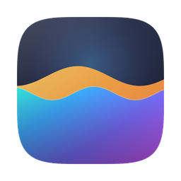
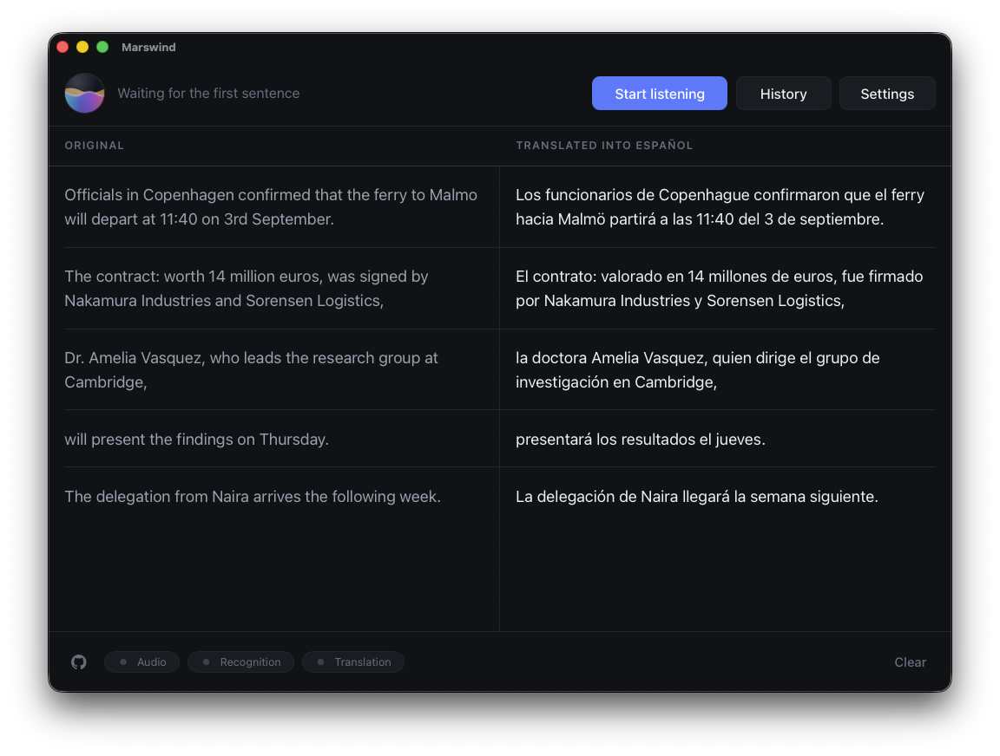

<div align="center">



# Marswind

**Live-Untertitel und Übersetzung für den Ton deines Computers. Vollständig
offline.**

[](../../LICENSE)
[](#plattformen)
[](#)

[English](../../README.md) ·
[Русский](README.ru.md) ·
**Deutsch** ·
[Español](README.es.md) ·
[Français](README.fr.md) ·
[Italiano](README.it.md) ·
[Português](README.pt.md) ·
[Polski](README.pl.md) ·
[Türkçe](README.tr.md) ·
[Українська](README.uk.md) ·
[中文](README.zh.md) ·
[日本語](README.ja.md) ·
[한국어](README.ko.md)



</div>

Marswind hört mit, was auf deinem Rechner läuft - ein YouTube-Video, ein
Google-Meet-, Teams- oder Zoom-Gespräch, eine lokale Videodatei - erkennt die
Sprache darin und übersetzt sie in die Sprache deiner Wahl, während gesprochen
wird.

Keine API-Schlüssel, keine Konten, kein Internet. Modelle werden einmal geladen
und laufen danach lokal; der Ton bleibt im Arbeitsspeicher, wird nie auf die
Festplatte geschrieben und nirgendwohin gesendet.

## Was es kann

- **Nimmt den Systemton auf**, ohne virtuellen Audiotreiber - alles, was der
  Rechner abspielt, oder nur eine Anwendung wie den Browser
- **Erkennt Sprache** mit whisper.cpp auf der GPU: Untertitel wachsen mit dem
  Gesprochenen, statt unter dem Lesenden umgeschrieben zu werden
- **Übersetzt beim Sprechen** - Wörter gehen an die Übersetzung, sobald sie
  feststehen, nicht erst am Satzende, und die Übersetzung trifft Wort für Wort ein
- **Verwaltet Modelle** in der App: sieben Erkennungs- und fünf
  Übersetzungsmodelle, mit Fortschrittsanzeige und SHA-256-Prüfung geladen
- **Zeichnet jede Sitzung auf** - später durchsuchbar und als Text, Untertitel
  (`.srt`) oder JSON mit den zugehörigen Zeiten exportierbar
- **Bringt Beispielclips mit**, damit man es ohne Videosuche ausprobieren kann
- **Spricht dreizehn Sprachen** - dieselben, in die es übersetzt - in hellem oder
  dunklem Design, mit einer Textgröße, die die ganze Oberfläche skaliert und
  nicht nur die Schrift

### Sprachen

Englisch, Russisch, Deutsch, Spanisch, Französisch, Italienisch, Portugiesisch,
Polnisch, Türkisch, Ukrainisch, Chinesisch, Japanisch und Koreanisch - als
Zielsprachen wie auch als Sprache des Fensters selbst. Die gesprochene Sprache
wird standardmäßig aus dem Ton ermittelt, und die Erkennung deckt alles ab, was
whisper kann.

## Wie es funktioniert

```
Systemton  →  Resampling auf 16 kHz mono  →  Sprachaktivitätserkennung (Silero)
           →  Spracherkennung (whisper.cpp)
           →  Übersetzung (llama.cpp, eigener Prozess)
           →  Transkript: links das Original, daneben die Übersetzung
```

Alles unterhalb der Oberfläche läuft in Rust auf eigenen Threads, und die
Übersetzung läuft in einer eigenen Binärdatei, weil whisper.cpp und llama.cpp
sich keinen Prozess teilen können. Aufbau und Begründungen stehen in
[docs/ARCHITECTURE.md](../ARCHITECTURE.md).

Gemessen auf Apple Silicon mit den Standardmodellen, auf dem synthetischen
Fixture-Korpus in [tests/](../../tests/README.md) - Mediane aus je drei Läufen:
der erste Untertitel etwa 6 Sekunden nach Beginn eines Clips, danach alle 2-3
Sekunden ein neuer, und eine Wortfehlerrate zwischen 4 % bei einer klaren Lesung
und 23 % bei einem Clip voller Eigennamen und Zahlen. Die Erkennung ist nicht
deterministisch und ein einzelner Lauf schwankt um rund zwanzig Punkte - das
sind also Mediane und keine Ergebnisse; wie die Zahlen entstehen, steht beim
Testaufbau.

## Plattformen

| Plattform | Stand |
|---|---|
| **macOS 14.4+** | Unterstützt - Core Audio Process Taps, Metal |
| **Windows** | In Entwicklung - WASAPI Loopback |
| **Linux** | In Entwicklung - PipeWire |

Die App baut und startet heute schon unter Windows und Linux, aber die
Tonaufnahme meldet sich dort als nicht verfügbar - ein Fenster ohne etwas zum
Zuhören. Alles oberhalb der Aufnahme ist bereits plattformunabhängig.

Ein virtueller Audiotreiber wie BlackHole ist auf **keiner** Plattform nötig:
die Aufnahme läuft über die nativen APIs des Betriebssystems.

## Voraussetzungen

| | |
|---|---|
| macOS | 14.4 oder neuer, Apple Silicon oder Intel |
| Speicher | 8 GB nur für die Erkennung, 16 GB mit Übersetzung |
| Festplatte | 0,5-4,5 GB für die gewählten Modelle |
| Zum Bauen | [Rust](https://rustup.rs), [Node.js](https://nodejs.org) 20+, cmake (`brew install cmake`) |

## Installation

### Herunterladen

Das [neueste Release](https://github.com/glenau/marswind/releases/latest)
enthält ein `.dmg`. Öffnen, Marswind nach Applications ziehen, fertig - rund
13 MB, denn die Modelle kommen später und nur die, die du auswählst.

**macOS verweigert den ersten Start.** Das Image ist signiert, aber nicht
notarisiert: Hinter diesem Projekt steht kein bezahltes
Developer-ID-Zertifikat, und alles ohne ein solches gilt Gatekeeper als
unbekannt. Der Weg dahin:

1. Die App öffnen und blockieren lassen. **Done** drücken, nicht "Move to Bin".
2. **Systemeinstellungen → Datenschutz & Sicherheit**, nach unten zu
   **Sicherheit** scrollen. Dort steht, dass Marswind blockiert wurde, daneben
   ein Knopf **Trotzdem öffnen**.
3. Draufdrücken, per Touch ID oder Passwort bestätigen und noch einmal
   bestätigen.

macOS fragt einmal und merkt es sich. Der Knopf erscheint erst nach einem
blockierten Start und bleibt etwa eine Stunde; ist er nicht da, die App noch
einmal öffnen.

Rechtsklick auf die App → Öffnen war die frühere Abkürzung dafür und
funktioniert auf macOS 14 weiterhin. macOS 15 hat sie entfernt, deshalb ist der
Weg über die Einstellungen der, der überall funktioniert.

### Oder selbst bauen

```bash
git clone https://github.com/glenau/marswind.git
cd marswind
npm install
npm run install:macos
```

Das baut den Übersetzungs-Worker, baut das Release-Bundle, signiert es ad-hoc
und kopiert es nach `/Applications/Marswind.app`. Der erste Build dauert einige
Minuten - whisper.cpp und llama.cpp werden aus dem Quelltext kompiliert. Sonst
wird nichts gebraucht: keine Submodule, keine von Hand zu installierenden
Bibliotheken und keine Modelle, die vorab geladen werden müssten.

### Erster Start

1. `open /Applications/Marswind.app`
2. macOS fragt nach der Berechtigung **Audioaufnahme**. Zustimmen - ohne sie hört
   die App nichts. Falls abgelehnt, lässt sie sich in Systemeinstellungen →
   Datenschutz & Sicherheit → Audioaufnahme wieder erteilen.
3. **Einstellungen** öffnen und je ein Erkennungs- und Übersetzungsmodell laden.
   `Large v3 Turbo (compressed)` und `Qwen3 4B Instruct` sind die Vorgaben ab
   16 GB; `Small` und `Qwen3 1.7B` passen in 8 GB. Rund 3 GB Download, jeweils
   gegen eine veröffentlichte Prüfsumme abgeglichen. Jede Zeile nennt die Lizenz
   ihrer Gewichte - siehe [docs/MODELS.md](../MODELS.md).
4. **Zuhören starten** drücken und etwas mit Sprache abspielen. In den
   Einstellungen liegen vier Beispielclips, falls du kein Video suchen willst.

Zwei Dinge zu einer selbst gebauten Kopie:

- **Sie ist ad-hoc signiert.** Die Signatur ist für einen Build stabil, also
  bleibt die Audio-Berechtigung erhalten - ein Rebuild erzeugt aber eine neue
  Identität, und macOS fragt erneut. Ein Developer-ID-Zertifikat beendet das, und
  es gibt noch keines.
- **Die App während des Betriebs nicht verschieben.** Zum Aktualisieren erneut
  `npm run install:macos` ausführen; es ersetzt `/Applications/Marswind.app`.

### Ein Disk-Image bauen

```bash
npm run build:dmg
```

Baut das Release-Bundle, signiert es und packt es in
`src-tauri/target/Marswind-<version>-<arch>.dmg` - dasselbe Image, das an ein
Release gehängt wird, mit demselben Gatekeeper-Vorbehalt wie oben. Die
Checkliste drumherum steht in [docs/RELEASING.md](../RELEASING.md).

## Entwicklung

`tauri dev` erzeugt eine nackte ausführbare Datei ohne `Info.plist` und ohne
Signatur, und Core Audio Process Taps funktionieren so nicht. Stattdessen dieser
Befehl - er baut ein Debug-Bundle, signiert es und startet es:

```bash
npm run dev:macos
```

| Befehl | Wirkung |
|---|---|
| `npm run dev:macos` | Debug-Bundle bauen, signieren und starten |
| `npm run install:macos` | Release-Bundle bauen und installieren |
| `npm run check` | Svelte- und TypeScript-Typen |
| `npm run build:dmg` | ein signiertes `.dmg` zum Weitergeben |
| `npm run build:sidecar` | nur den Übersetzungs-Worker |
| `npm run build:icons` | das App-Icon aus `scripts/make-icon.py` neu zeichnen |
| `npm run licenses` | `THIRD-PARTY-NOTICES.md` aus den Lockfiles neu erzeugen |

Es gibt keine CI: whisper.cpp und llama.cpp werden aus dem Quelltext kompiliert
und der Testaufbau spielt Ton über die Systemausgabe ab, also ist jede Prüfung
ein lokaler Befehl. [CONTRIBUTING.md](../../CONTRIBUTING.md) listet sie auf.

## Tests

Unit-Tests decken die reine Logik ab; die Skripte in
[tests/](../../tests/README.md) spielen Ton über die Systemausgabe ab und
bewerten, was aus der echten Pipeline zurückkommt - Erkennung, Übersetzung und
Latenz zusammen.

```bash
npm run build:sidecar
cargo test --manifest-path src-tauri/Cargo.toml
```

Die erste Zeile braucht es einmal, danach nur nach einem `cargo clean`. Tauri
bündelt den Übersetzungs-Worker als Sidecar, also weigert sich dessen
Build-Skript, `src-tauri` überhaupt zu bauen, solange die Binary fehlt - auf
einem frischen Klon bleibt `cargo test` allein bei
`resource path 'binaries/marswind-translator-…' doesn't exist` stehen. Jeder
`npm run`-Befehl erledigt diesen Schritt; ein direkter `cargo`-Aufruf nicht.

Die Pipeline-Skripte brauchen ein gebautes, signiertes Bundle und installierte
Modelle:

```bash
npm run dev:macos
tests/run-capture.sh
tests/run-asr.sh
tests/run-pipeline.sh
```

Ein einzelner Durchlauf über den Korpus schwankt um rund zwanzig Punkte
Wortfehlerrate, eine einzelne Zahl sagt also nichts. Vergleiche Mediane über
mehrere Durchläufe und lies die Transkripte, nicht nur die Werte.

## Datenschutz

- Ton wird **im Arbeitsspeicher** aufgenommen, umgerechnet und erkannt. Er wird
  nie auf die Festplatte geschrieben und nie versendet.
- Der einzige Netzwerkverkehr ist das Laden der Modelle, die du anforderst. Danach
  gibt es gar keinen mehr.
- Keine Telemetrie, keine Analytik, keine Absturzberichte, kein Konto.
- Transkripte liegen ausschließlich im App-Datenverzeichnis, damit die
  Verlaufsansicht etwas zu zeigen hat. Löschen lassen sie sich in der App.

## Mitmachen

Fehlerberichte, Ideen und Pull Requests sind willkommen.
[CONTRIBUTING.md](../../CONTRIBUTING.md) beschreibt Setup, Prüfungen,
Commit-Konvention und worauf das Review achtet. Bitte vor größeren Änderungen
ein Issue eröffnen - einige naheliegende Verbesserungen wurden bereits versucht
und mit dokumentierten Messungen wieder zurückgenommen.

- [Verhaltenskodex](../../CODE_OF_CONDUCT.md)
- [Sicherheitsrichtlinie](../../SECURITY.md) - Schwachstellen bitte privat melden,
  nicht als Issue

## Gebaut auf

| | | |
|---|---|---|
| [whisper.cpp](https://github.com/ggml-org/whisper.cpp) | MIT | Erkennung, und die Silero-VAD-Implementierung dazu |
| [llama.cpp](https://github.com/ggml-org/llama.cpp) | MIT | Übersetzung, im eigenen Prozess |
| [ggml](https://github.com/ggml-org/ggml) | MIT | die Tensor-Bibliothek und das Metal-Backend unter beiden |
| [whisper-rs](https://codeberg.org/tazz4843/whisper-rs) | Unlicense | die Rust-Anbindung an whisper.cpp |
| [llama-cpp-2](https://github.com/utilityai/llama-cpp-rs) | MIT / Apache-2.0 | die Rust-Anbindung an llama.cpp |
| [Silero VAD](https://github.com/snakers4/silero-vad) | MIT | das Modell, das Phrasengrenzen findet |
| [Tauri](https://tauri.app) | MIT / Apache-2.0 | das Fenster und die Prozessgrenze |
| [Svelte](https://svelte.dev) | MIT | die Oberfläche |
| [rubato](https://github.com/HEnquist/rubato) | MIT | der FFT-Resampler vor whisper |

Der vollständige Abhängigkeitsbaum mit der Lizenz jedes Pakets steht in
[THIRD-PARTY-NOTICES.md](../../THIRD-PARTY-NOTICES.md) - aus den Lockfiles
erzeugt und in der App neben der Lizenz selbst mitgeliefert.

**Für die Modelle gilt davon nichts.** Sie werden auf deine Anfrage von
[Hugging Face](https://huggingface.co) geladen und behalten die Bedingungen
ihrer Herausgeber: die whisper- und Silero-Modelle sind MIT, Qwen3 ist
Apache-2.0, und Gemma 3 steht unter
[Googles eigenen Bedingungen](https://ai.google.dev/gemma/terms), die keine
Open-Source-Lizenz sind und die Verwendung der Ausgabe einschränken. Jede Zeile
in den Einstellungen nennt ihre Lizenz, bevor der Download beginnt. Details in
[docs/MODELS.md](../MODELS.md).

## Lizenz

MIT - siehe [LICENSE](../../LICENSE). Das gilt für dieses Repository; es gilt
nicht für die Modelle, und die Liste oben ersetzt die Lizenzen nicht, auf die
sie verweist.